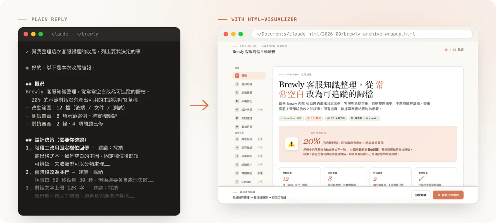
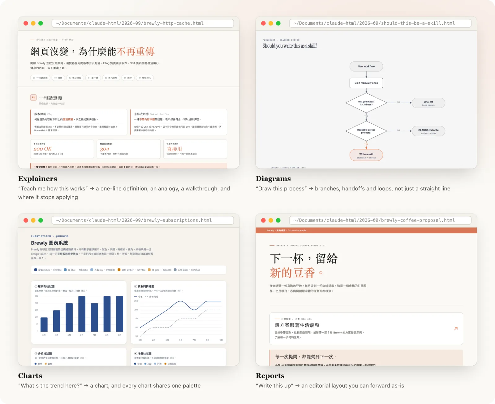

# html-visualizer

> [繁體中文](README.md)

**Gets your AI to turn long answers into a readable web page instead of a wall of text.**



Same question. On the left, what you get today; on the right, what you get with this installed. *(The samples are in Chinese — generated pages follow the language you chat in.)*

[See what it looks like](#what-it-looks-like) · [Install](#install) · [Common questions](#common-questions)

---

## What it fixes

You ask your AI something. It replies with three hundred lines of text. The content may be fine, but you have to scroll from top to bottom, and by the end you've forgotten the beginning.

With this installed, the same question gets you a web page: jump around with a table of contents, compare things side by side in a table, and see an actual diagram where a diagram belongs. You can also just hand the file to a colleague.

**No new commands to learn, and you don't change how you talk.** It shows up on its own when the answer is long. When you don't want it, say "just give me plain text".

---

## What it looks like

### When you need to decide: pick on the page, paste back in one click


Each thing the AI needs you to decide sits right next to its explanation, with the options and a note box on the same card. Pick, click "Copy decision summary", paste it back, and the AI carries on with your calls. No more typing "for #1 go with A, for #2 I'd rather…".

### Click a box in a diagram, read the details beside it


A box in a diagram only fits a few words. Now every box can carry a short write-up, and clicking it opens that write-up in a floating panel: what the step does, why, and what you need to decide. Drag the panel wherever it's handy; click anywhere outside to close it. On a phone it becomes a drawer that slides up from the bottom.

### Text too small? Adjust it yourself — and keep it as your default


Every page has a style-settings button: text size (90%–200%), spacing, and content width, all applied instantly. On pages with a copy bar at the bottom it sits next to the preview button; elsewhere it stays in the bottom-left corner. (The bundled examples aren't stamped, so they don't show the button; it's added to pages your AI makes when it runs its self-check.)

Once it looks right, click "save as my default". When you paste the summary back, your AI writes those settings into your profile, and every page it makes after that opens at that size. If you don't click it, only the page in front of you changes and nothing is saved.

> The style-settings panel comes in Chinese and English. It follows the page's language, and the button at its top right switches it; your choice is remembered. The diagram panel's labels are still Chinese only.

### Different content, different layouts



It picks a layout to fit the content instead of stamping the same template every time:

| You say | You get |
|---|---|
| "Summarize these meeting notes" | A summary page: conclusions up front, details grouped into sections, action items listed separately |
| "Teach me how this works" | A tutorial page: one line to define it, then an analogy, then a walkthrough, and finally when it stops applying |
| "Which of these approaches should I pick?" | A comparison page you can actually tick your answers on, then copy them in one click and paste back |
| "Put this plan in front of my boss" | A page for non-technical readers: top-down, with screen mockups, and the confusing technical bits hidden |
| "What's the trend in these numbers?" | A chart, not a pile of numbers |
| "Draw this process for me" | A flow diagram, with branches, handoffs and loops back |

### Send it to a colleague — it reads fine on a phone


The output is a single HTML file you open in any browser. On a phone it drops the desktop margins so the width goes to the content.

### It checks its own work before you see it

Before handing you a page it opens it in a real browser at phone, tablet and desktop widths and confirms nothing spills off the screen, no text gets squeezed, and the buttons actually respond. It also bumps the text size to 200% once to make sure nearly every block of text (95% or more) actually grows. Details are under *Technical detail* below.

---

## Install

**The easy way**: paste this URL to your AI and tell it "install this for me".

```
https://github.com/chenjackle45/html-visualizer
```

That's it. It reads the instructions and puts everything in the right place. When it's done, tell it to reload, or just restart.

Works with Claude Code, Codex, Cursor, Cline, GitHub Copilot, OpenCode and others — anything that understands skills.

<details>
<summary>If you'd rather do it yourself</summary>

**Claude Code** has a built-in package manager:

```
/plugin marketplace add chenjackle45/html-visualizer
/plugin install html-visualizer@chenjackle45
```

Check with `/plugin list`. Update with `/plugin update html-visualizer@chenjackle45`, remove with `/plugin uninstall html-visualizer@chenjackle45`.

**claude.ai (web) / Claude Cowork** doesn't take plugins — upload each skill as a zip (Settings → Capabilities → Skills). The skill folder itself must be the zip root, one zip per skill:

```
git clone https://github.com/chenjackle45/html-visualizer.git
cd html-visualizer/skills
zip -r html-visualizer.zip html-visualizer
zip -r chart.zip chart
zip -r diagram-design.zip diagram-design
```

Upload the three zips separately. The web upload has two limits the docs don't spell out: `description` max 200 characters (the Agent Skills spec says 1024) and max 200 files per zip. All three here stay under both. If you edit a description, run `python3 tests/check-frontmatter.py` before uploading.

**Everything else** — clone it and run the installer:

```
git clone https://github.com/chenjackle45/html-visualizer.git
cd html-visualizer
./install.sh --detect
```

`--detect` finds the skill folders your AI tools already use and installs into all of them. Other options:

| Command | What it does |
|---|---|
| `./install.sh` | Installs to `~/.agents/skills/` (shared by several tools) |
| `./install.sh --dir <path>` | Installs to a folder you name |
| `./install.sh --copy` | Copies instead of symlinking |
| `./install.sh --uninstall` | Removes it |

To update, run `git pull` in the cloned folder — no reinstall needed.

Needs `python3` (3.8 or newer) on your machine.

</details>

---

## Using it

**Just talk normally.** All of these work:

- "Turn this into a report"
- "Give me a version I can show people"
- "List some options for me to pick from"
- "Explain this to me"
- "Draw this process"

If it doesn't kick in, just say "make this a web page".

Pages open in your browser automatically and are saved to `~/Documents/claude-html/`, with an index so you can find "that one from last week".

**Your taste can be saved.** Besides "save as my default" on a page, you can just tell your AI things like "use sans-serif headings from now on", "make the accent color blue" or "no emoji". It records them in `~/.config/html-visualizer/profile.json` and every later page follows them. To see what's saved, ask "show me my profile".

---

## Common questions

**My AI doesn't seem to know about it.**
Restart, or tell it to reload its skills.

**The answer is still a wall of text.**
Short answers deliberately don't trigger it — you don't want a web page for a one-liner. Just say "make this a web page" if you want one.

**I clicked "save as my default" on claude.ai and it was gone next time.**
The claude.ai web app and Cowork start a fresh environment each time, so the profile can't be kept there — it only affects that session. Saving defaults needs a tool that runs on your own machine, such as Claude Code or Codex.

**A check says "unverified" — is something broken?**
No. Before showing you a page it checks the layout isn't broken, and that step needs the browser automation tool Playwright. Without it the check says "unverified", meaning "not checked" — not "something's wrong". If you have Chrome installed, `npm i -D playwright` is enough — it borrows your Chrome. Without Chrome, also run `npx playwright install chromium`.

---

<details>
<summary>Technical detail: what this actually does</summary>

Three skills working together:

| Skill | Role |
|---|---|
| `html-visualizer` | The entry point. Picks a layout, builds the page, runs the self-check, opens it |
| `chart` | Data charts, drawn with `@unovis`, sharing one palette across chart types |
| `diagram-design` | Structure diagrams as hand-laid SVG. A fork of [cathrynlavery/diagram-design](https://github.com/cathrynlavery/diagram-design) v2.6 |

**Why not just ask the AI for HTML**: because AI-generated HTML fails silently, and the AI can't see it. So a self-check runs before the page reaches you. Every item maps to a real incident:


| Check | The incident it prevents |
|---|---|
| Syntax-check every script, then actually open the page and click the copy button | A copy button that did nothing at all. Once a single newline broke the whole script; once a missing section left the code tripping over an empty value |
| Parse every stylesheet, catch stray or unterminated braces | A page with no styling whatsoever, because the CSS was cut mid-rule. Braces had been counted and matched exactly, so nothing looked wrong |
| Render at phone, tablet and desktop widths in a real browser | The same page looks fine on a desktop and spills off a phone |
| Four invisible failures: text squeezed into a vertical strip, elements flattened, contrast too low, content hidden behind something | A report passed every check, then came back with the text rendered one character per line |
| Bump the text size to 200% and measure how much text actually grows | One block of hard-coded text stays put while the rest grows, so the page ends up with mixed sizes |
| Consistency of the tick-box wiring | You answer everything and the copied summary silently drops three of them |

**It rewrites the file it checks**: before checking, it "stamps" the page — applies your profile, turns hard-coded text sizes into adjustable ones, and adds the style-settings panel. Running it again changes nothing further; with no profile set and at 100%, the page looks exactly as before apart from the added style-settings button. Pass `--no-stamp` when you don't want the file touched (for example, when reviewing someone else's page).

**Cross-tool**: nothing is vendor-locked. The skill config uses only the two most common fields, and the scripts need just `python3` plus optional `node`. For the session label it tries environment variables, then the Git branch, then the folder name. To open a page it uses a browser tool if there is one, otherwise the system opener, and failing that it just tells you where the file is.

**Settings**:

| Environment variable | Effect |
|---|---|
| `HTML_VISUALIZER_ARCHIVE_DIR` | Where pages are saved (default `~/Documents/claude-html`) |
| `HTML_VISUALIZER_PLAYWRIGHT_ROOT` | Extra path to look for Playwright |
| `HTML_VISUALIZER_PROFILE` | Where your profile lives (default `~/.config/html-visualizer/profile.json`) |

After installing, `skills/html-visualizer/references/examples/` has working examples you can open (they don't include the style-settings panel; it's added during the self-check).

</details>

---

## Language

The skill instructions are written in Traditional Chinese (the author's working language). **Generated pages follow the language of your conversation** — chat in English and you get English pages. The style-settings panel has Chinese and English labels and follows the page's language (switch it at the panel's top right; the choice is remembered). The diagram panel is Chinese only.

## Author

Jackle Chen — [jackle.pro](https://jackle.pro/) · [@chenjackle45](https://github.com/chenjackle45)

Questions and suggestions: [open an issue](https://github.com/chenjackle45/html-visualizer/issues).

## Credits

- [diagram-design](https://github.com/cathrynlavery/diagram-design) by Cathryn Lavery — MIT. Icons: Tabler (MIT), Simple Icons (CC0), Devicon (MIT), log-z/logos (MIT). See `skills/diagram-design/THIRD_PARTY_LICENSES.md`.
- [@unovis](https://unovis.dev) — Apache-2.0, loaded from CDN.
- [Tailwind CSS](https://tailwindcss.com) — MIT, loaded from CDN.
- [Mermaid](https://mermaid.js.org) — MIT, loaded only when you explicitly ask for a Mermaid diagram.
- The "code-shape" component was inspired by HumanLayer's *show-me* skill.
- The default visual style follows Anthropic's editorial look; nothing is copied from Anthropic.

## License

MIT — see `LICENSE`. Third-party material keeps its own license.
